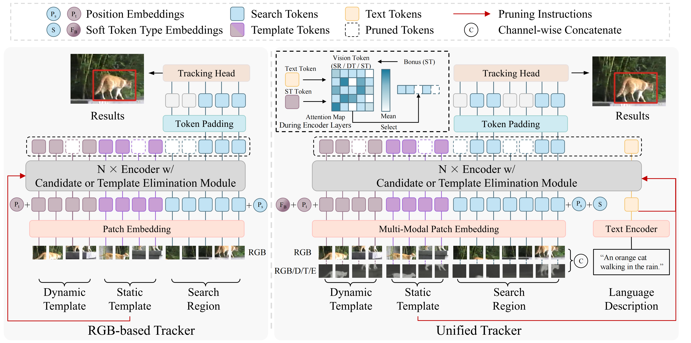

<h1 align="center">
<span>UTPTrack: Towards Simple and Unified Token Pruning for Visual Tracking
</span>
</h1>

<div align="center">


[](https://arxiv.org/abs/2602.23734)
[](https://huggingface.co/HarrisonWu/UTPTrack)
[](https://opensource.org/licenses/Apache-2.0)
[](https://github.com/EIT-NLP/UTPTrack)


</div>

> <strong> UTPTrack: Towards Simple and Unified Token Pruning for Visual Tracking </strong>
>
> <a href="https://harrisonwu42.github.io/" rel="nofollow">Hao Wu</a><sup>\*,1,2</sup>, 
<a href="https://scholar.google.com/citations?user=WP9E-ogAAAAJ" rel="nofollow">Xudong Wang</a><sup>\*,1</sup>,
<a href="https://scholar.google.com/citations?user=zk2uLXoAAAAJ" rel="nofollow">Jialiang Zhang</a><sup>1</sup>,
<a href="https://scholar.google.com/citations?user=Amv2QE8AAAAJ" rel="nofollow">Junlong Tong</a><sup>1,2,3</sup>, 
<a href="https://skycxh.github.io/" rel="nofollow">Xinghao Chen</a><sup>1,4</sup>, 
<a href="https://scholar.google.com/citations?user=nbuk8v8AAAAJ" rel="nofollow">Junyan Lin</a><sup>1,4</sup>, 
<a href="https://yunpuma.github.io/" rel="nofollow">Yunpu Ma</a><sup>5</sup>, 
<a href="https://chin-gyou.github.io/" rel="nofollow">Xiaoyu Shen</a><sup>†,1,2</sup> 
>
> <sup>1</sup>Institute of Digital Twin, Eastern Institute of Technology, Ningbo 
>
> <sup>2</sup>Ningbo Key Laboratory of Spatial Intelligence and Digital Derivative
>
> <sup>3</sup>Shanghai Jiao Tong University
> <sup>4</sup>The Hong Kong Polytechnic University
>
> <sup>5</sup>Munich Center of Machine Learning, LMU Munich
>
> <sup>\*</sup> Equal Contribution, <sup>†</sup> Corresponding Author.
>
> Contact: haowu.ai.research@gmail.com, xyshen@eitech.edu.cn


<p align="center">
  
</p>

If you find this work useful for your research and applications, please consider citing:

```bibtex
@misc{wu2026utptracksimpleunifiedtoken,
      title={UTPTrack: Towards Simple and Unified Token Pruning for Visual Tracking}, 
      author={Hao Wu and Xudong Wang and Jialiang Zhang and Junlong Tong and Xinghao Chen and Junyan Lin and Yunpu Ma and Xiaoyu Shen},
      year={2026},
      eprint={2602.23734},
      archivePrefix={arXiv},
      primaryClass={cs.CV},
      url={https://arxiv.org/abs/2602.23734}, 
}
```

<!-- 🔥 📚 👀 🌟 ✨ ✒️ 🎯 📄 🙏 ✉️ 🤗 🌐 🚀 🔔 💡 🔧 ⭐️ -->


## 🔥News <a id="news"></a>

- **[2026.04.05]** Code, checkpoints, and documentation are released.
- **[2026.02.27]** The preprint is now published! 
- **[2026.02.21]** 🎉 UTPTrack is accepted by CVPR 2026 !


## 💡 Highlights <a id="highlights"></a>

- **Unified pruning across three components**: UTPTrack is the first unified token pruning framework that jointly prunes search region, dynamic template, and static template, enabling holistic redundancy modeling.
- **Unified pruning across modalities**: The proposed pruning strategy naturally generalizes to RGB, multimodal, and language-guided tracking via modality-aware and text-guided token selection.
- **More pruning, better performance**: Removes over 65% tokens while matching or even outperforming the base model, effectively eliminating redundancy without harming key representations.

## 📚 Contents <a id="contents"></a>

- [News](#news): Latest updates, news, and announcements.
- [Highlights](#highlights): Core insights and key features highlighted in this work.
- [Preparation & Usage](#usage): Environment setup, dependencies, checkpoint/data preparation, and instructions for training and evaluation.
- [License](#license): License information for this repository.
- [Acknowledgments](#acknowledgments): Credits to projects and contributors that inspired or supported this work.
- [Contact](#contact): Contact information for questions, feedback, or collaboration.
- [Related Projects](#projects): Research projects from our group ([EIT-NLP](https://idt.eitech.edu.cn/nlp/)) related to MLLM compression.

## 🎯 Preparation & Usage <a id="usage"></a>

See [UTPTrack-O](https://github.com/EIT-NLP/UTPTrack/tree/main/UTPTrack-O) and [UTPTrack-S](https://github.com/EIT-NLP/UTPTrack/tree/main/UTPTrack-S) for details.


## 📄 License <a id="license"></a>

This project is released under the [Apache 2.0 license](https://opensource.org/licenses/Apache-2.0).


## 🙏 Acknowledgments <a id="acknowledgments"></a>

- Thanks for the [OSTrack](https://github.com/botaoye/OSTrack) and [SUTrack](https://github.com/chenxin-dlut/SUTrack) library, which helps us to quickly implement our ideas.


## ✉️ Contact <a id="contact"></a>

For questions, suggestions, or collaboration opportunities, please feel free to reach out:

- **Hao Wu**: haowu.ai.research@gmail.com
- **Xiaoyu Shen**: xyshen@eitech.edu.cn


## 🌐 Related Projects (ours) <a id="projects"></a>
- Survey
  - [Preprint] [From Data to Model: A Survey of the Compression Lifecycle in MLLMs](https://github.com/EIT-NLP/Awesome-MLLM-Compression)
- ImageLLM
  - [EMNLP 25] [VisiPruner: Decoding Discontinuous Cross-Modal Dynamics for Efficient Multimodal LLMs](https://github.com/EIT-NLP/VisiPruner)
  - [ICLR 26] [HiDrop: Hierarchical Vision Token Reduction in MLLMs via Late Injection, Concave Pyramid Pruning, and Early Exit](https://github.com/EIT-NLP/HiDrop)
  - [Preprint] [ViCA: Efficient Multimodal LLMs with Vision-Only Cross-Attention
](https://arxiv.org/abs/2602.07574)